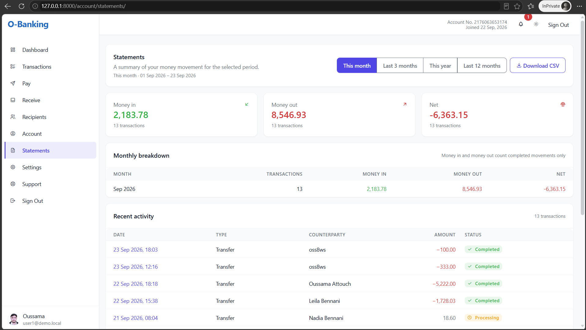
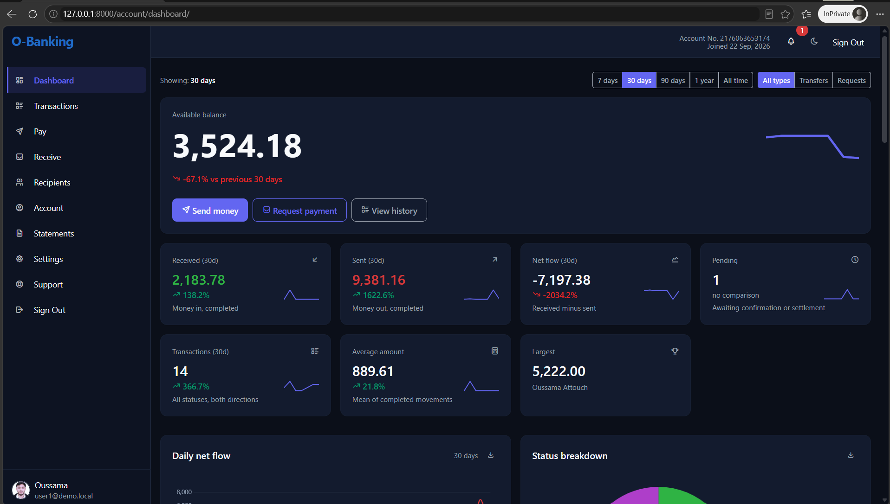
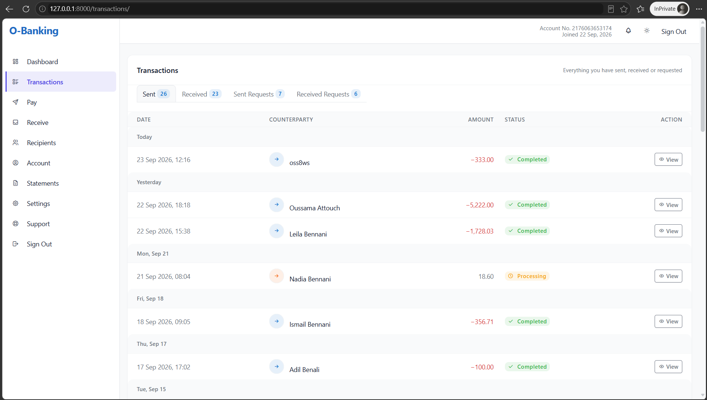
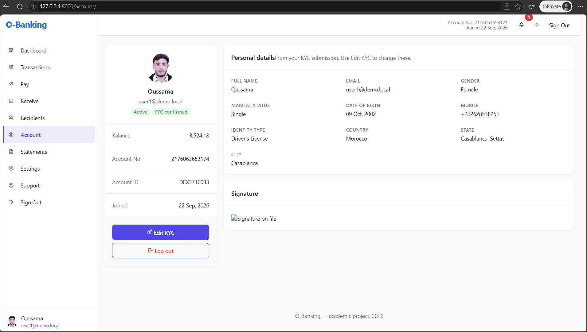
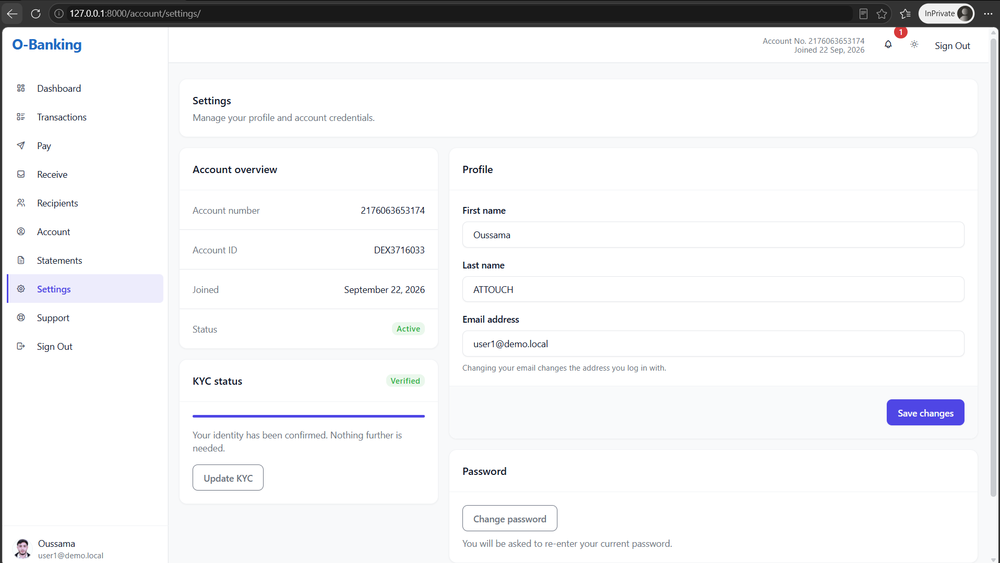
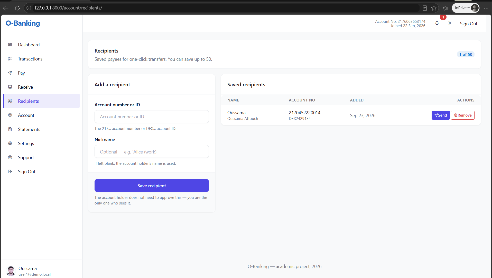
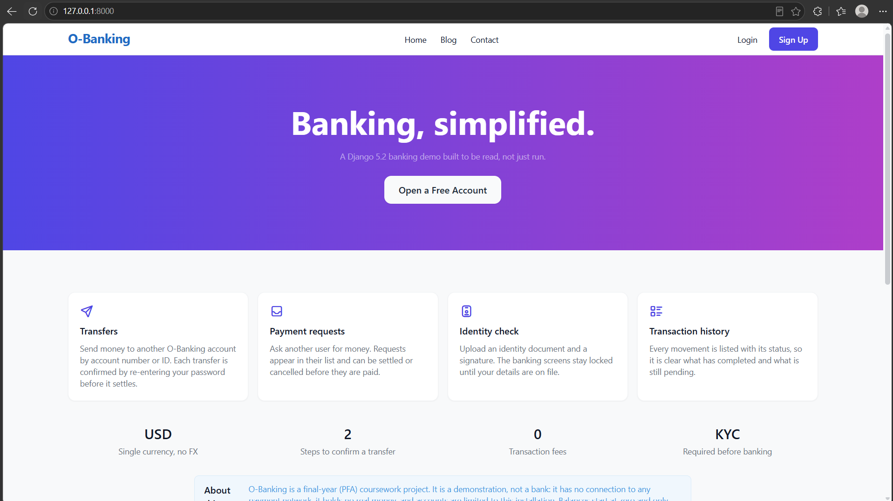
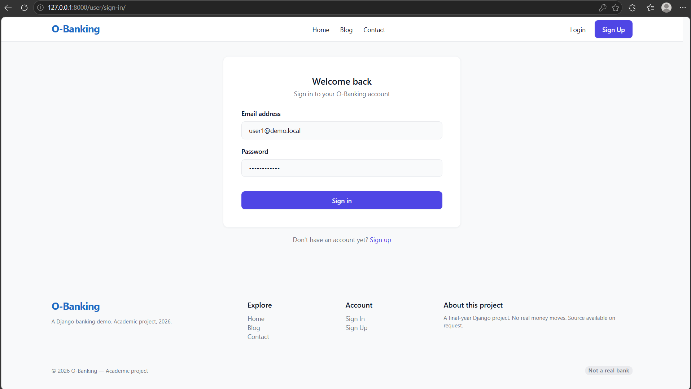

# O-Banking

A Django 5.2 banking demo — audited, modernized, and rebuilt on a permissively-licensed UI.

`Django 5.2 LTS` · `Python 3.12` · `SQLite` · `Tabler 1.5.1` · `Chart.js 4.4.4` · `MIT` · `194 tests passing`

## Table of contents

- [Context](#context)
- [Problem Statement](#problem-statement)
- [Solution Overview](#solution-overview)
- [Screenshots](#screenshots)
- [Architecture](#architecture)
- [Key Features](#key-features)
- [Technical Stack](#technical-stack)
- [Engineering Decisions](#engineering-decisions)
- [Results](#results)
- [Quick Start](#quick-start)
- [Test Credentials](#test-credentials)
- [Seed Instructions](#seed-instructions)
- [Project Structure](#project-structure)
- [Documentation](#documentation)
- [Future Work](#future-work)
- [Author](#author)

## Context

O-Banking is a server-rendered Django monolith for a simulated bank. It covers registration and email login, KYC submission with document upload, transfers between accounts, payment requests and their settlement, a dashboard with KPIs and charts, statements with CSV export, saved recipients, a notification center, an in-app support ticket system, and a user settings page. Alongside the banking application sit a public blog and a contact page.

The project exists because of a final-year PFA. The codebase started as a 2022 Django 3.1 project that had never been audited: it was imported as received and then left alone. It was returned to in 2026 to fix its security problems, modernize the stack, and rebuild the interface on a theme that can legally ship.

## Problem Statement

**P1 — Security.** A first-year codebase carried a money-theft vector (a negative transfer credited the sender and debited the recipient), IDOR on every transaction lookup, 14 money-movement views without `@login_required`, a 4-digit PIN stored plaintext and printed to stdout, an URL-driven account redirect on the confirmation pages, and a save hook that silently reverted balances.

**P2 — UI and licensing.** The interface was built on a vendored commercial template with no LICENSE file and a GPL-v2 dependency, so the project could not be published. It was also loaded half-broken: two divergent asset trees, page templates still referencing an asset tree that was on its way out, and a sidebar carrying dead links and fake notification and profile widgets.

**P3 — Testing and demo data.** There were no real tests: three stubs totalling four lines. No README and no CI. A single-user SQLite database with no meaningful seed data, so the dashboard had nothing to display and nothing could be demonstrated.

## Solution Overview

**Security audit.** Eleven phases, each landing with a test that first proved the defect and then proved the fix. The suite that grew out of that work is 194 Django `TestCase` tests covering money movement, authorization, the seeder, and every feature added since.

**Stack upgrade.** Django 3.1 → 5.2 LTS and Python 3.9 → 3.12. The dependency list was cut to the five packages the code actually imports: Django, django-jazzmin, django-import-export, shortuuid, and Pillow.

**UI migration.** The original theme was replaced by Tabler 1.5.1 (MIT), vendored as prebuilt files so the application runs offline. `static/` went from 13.99 MB across 206 files to 2.38 MB across 11. A purple-accent design layer with dark mode lives in one stylesheet, `static/tabler/css/ob-theme.css`.

**Demo data and features.** A `seed_demo` command generates 150 users and 3,000 transactions over 24 months, with balances replayed to match. Five feature areas were then built on top: statements with CSV export, saved recipients, a notification center, a support ticket system, and a user settings page.

## Screenshots

### Dashboard

| Light mode | Dark mode |
| --- | --- |
|  |  |

8 KPIs, 4 charts, 2 summary tables, and a paginated transaction history. A single period-and-type filter bar (7 days / 30 days / 90 days / 1 year / All time · All types / Transfers / Requests) recomputes every KPI and every chart from the same query parameters.

### Banking

| Transactions | Account |
| --- | --- |
|  |  |

| Statements | Recipients |
| --- | --- |
|  |  |

### Public

| Landing | Sign in |
| --- | --- |
|  |  |

Additional screenshots — sign-up, the dashboard charts and history in isolation, transfer completion, settings, and a support ticket thread — are kept in [`docs/screenshots/`](docs/screenshots/).

## Architecture

A server-rendered Django monolith. There is no separate API, no single-page application, and no JavaScript build step — every page is rendered by a view and returned as HTML.

| Area | Detail |
| --- | --- |
| Shells | `templates/partials/base.html` (public) and `templates/partials/dashboard-base.html` (authenticated). Their `:root` blocks are byte-identical, and a probe asserts they stay that way. |
| Apps | `core` (money movement, landing), `userauths` (auth), `account` (accounts, KYC, recipients, notifications, support, settings), `pages` (blog and contact) |
| Data | SQLite. `Account.account_balance` is the single source of truth: there is no ledger and no event-sourced table. |
| Direction | transfer: sender → reciever. Settled request: reciever → sender (the requester is credited). |
| Auth | Email is the login field (`USERNAME_FIELD = 'email'`); `username` is required but is not the credential. |
| Charts | Chart.js 4.4.4, vendored. Four dashboard charts: line, doughnut, grouped bar, and a filled area chart. |

Every page is server-rendered. The only JavaScript is Chart.js and Tabler's own bundle.

## Key Features

- User registration with email login
- KYC submission with document upload
- Transfers between accounts: password re-entry, atomic, `select_for_update`, URL/transaction mismatch guard
- Payment requests and settlements, with a separate settlement direction rule
- Dashboard: 8 KPIs, 4 charts, 2 summary tables, and a filtered paginated history
- Period and type filter bar that recomputes every KPI and every chart from one row of links
- KPI sparklines, delta chips, and dark mode
- Statements with a range selector (this month, last 3 months, this year, last 12 months) and CSV export
- Saved recipients for one-click transfers
- Notification center: a bell in the topbar with an unread badge, a 5-item dropdown, and a paginated list
- Immutable audit log: append-only `LogEntry` for sensitive actions, with a read-only admin
- Rate limiting on login, transfer, settlement, and payment-request confirmation
- Support tickets: inline create, thread view, and staff replies from the admin
- User settings: profile editing and password change
- Public blog (list, detail, category filter) and a contact form
- `seed_demo` management command for reproducible demo data
- Django admin with Jazzmin and `ImportExportModelAdmin`

## Technical Stack

| Layer | Choice | Why |
| --- | --- | --- |
| Language | Python 3.12 | Modern syntax and current security support |
| Framework | Django 5.2 LTS | Supported through April 2028 |
| Database | SQLite | Zero-configuration development and a single-file demo database |
| UI framework | Tabler 1.5.1 (MIT) | Permissively licensed and shippable |
| Charts | Chart.js 4.4.4 | Vendored locally; no CDN, works offline |
| Admin theme | django-jazzmin 3.0.5 | Admin skin without forking the admin |
| Import/export | django-import-export 4.4.1 | Backs the admin's `ImportExportModelAdmin` |
| ID generation | shortuuid 1.0.13 | Compact, non-sequential account and transaction identifiers |
| Images | Pillow 12.3.0 | Required by `ImageField` for KYC uploads |

## Engineering Decisions

### a) The PIN was removed, not hashed

A 4-digit secret is a keyspace of 10^4, so hashing it would not have made it strong, and it was also written to stdout on every transfer — and therefore into the server logs. Transfers now ask for the account password and verify it with `check_password`.

### b) Settlement direction is asymmetric

For a payment request the stored `sender` is the requester and the stored `reciever` is the payer, so on settlement money moves reciever → sender. The analytics layer encodes this once, and the templates mirror it rather than re-deriving it per page.

### c) The seeder replicates view-level balance mutation

There is no ledger: `Account.account_balance` is a mutable scalar the views update directly. A seeder that wrote `Transaction` rows without matching balance updates would have produced a dashboard whose KPIs contradicted its own charts, so it replays the same mutation after a bulk insert, keeping the insert fast.

### d) URL/transaction mismatch is rejected

The transfer and settlement confirmation views originally derived the credited account from the `account_number` in the URL, so either party could POST a different number and redirect the funds. Both now require the URL account to match the transaction's stored counterparty. Three pre-existing tests encoded the bug and were rewritten.

### e) HSTS is short and preload is off

`security.W021` is accepted by design. Preload at one year is right for a real bank on a real domain, but on a portfolio demo it is a footgun: browsers hard-block HTTP for a year and the preload list is awkward to leave. The rationale is recorded inline in `settings.py` beside the setting.

### f) Two shells are mirrored, not unified

`base.html` and `dashboard-base.html` hold byte-identical `:root` and design blocks, and a probe asserts they remain byte-identical. A shared partial was rejected because a mid-migration edit to one shell would have silently diverged the two, invisibly in review.

### g) Chart.js reads CSS variables, not hex

Every chart colour resolves through `getComputedStyle` against the `--tblr-*` custom properties at paint time. The dark-mode toggle dispatches an `ob:theme-changed` event and the charts rebuild against the new palette, so there is no second colour table to keep in step.

### h) The test suite runs under a weaker hasher

`manage.py test` swaps PBKDF2 for MD5 when `'test'` is in `sys.argv`. Fixture users never authenticate against a real backend, and PBKDF2 costs roughly 1.7 seconds per hash, which dominated the suite. The production hasher is unchanged.

### i) The notification signal observes Transaction without modifying it

One notification is created per state transition, by comparing the status captured in `pre_save` against the value written in `post_save`. The signal reads transactions; it never changes how they are written, so the money path is untouched.

### j) The audit log is append-only, not editable

`audit.LogEntry` refuses every mutation path: `save()` on an existing row, `delete()`, `queryset.update()`, `queryset.delete()`, `bulk_create()`, `get_or_create()`, and `update_or_create()` all raise `PermissionError`. The admin is read-only. `actor` uses `SET_NULL`, so deleting a user leaves their entries in place with a null actor — a user cannot erase their own audit trail by deleting their account.

The write path is a single helper, `audit.utils.log()`, which never raises: a logging failure cannot take down the request that triggered it. `AuditContextMiddleware` stores the current request in a thread-local so the helper can resolve the actor, IP, and user-agent from any view without threading the request through every call site.

### k) Rate limiting is a fixed window, not a lockout

Login is limited to 5 attempts per email per 15 minutes; transfer, settlement, and payment-request confirmation to 10 attempts per user per hour. The window is fixed at the first attempt (`cache.add` sets the timeout; `cache.incr` never resets it), so a burst of failures does not extend the lockout indefinitely. Only POSTs consume the quota, and a successful login clears the counter for that email. The limiter uses Django's default LocMemCache and is therefore per-process — correct for a single-worker dev server, listed in Future Work as needing a shared cache in production.

## Results

- 194 tests, from 0 (three stubs, four lines)
- `static/` 13.99 MB → 2.38 MB (−83%, 206 files → 11)
- 7 critical bugs from the original audit closed
- 5 further bugs surfaced during modernization: balance corruption, PIN written to stdout, replayable transfer, settlement KYC crash, and the URL-direction redirect
- `seed_demo`: 150 users, 3,000 transactions, 24 months
- Django 3.1 → 5.2 LTS, Python 3.9 → 3.12
- Suite runtime brought to ~7 s by the test-runner hasher swap, from a run dominated by PBKDF2 at ~1.7 s per fixture user

## Quick Start

Prerequisites: Python 3.12 and Git.

```bash
git clone https://github.com/oussama-attouch/O-Banking_Payment_Project.git
cd O-Banking_Payment_Project
py -3.12 -m venv venv
.\venv\Scripts\pip install -r requirements.txt
$env:DJANGO_DEBUG=1
.\venv\Scripts\python.exe manage.py migrate
.\venv\Scripts\python.exe manage.py seed_demo
.\venv\Scripts\python.exe manage.py createsuperuser
.\venv\Scripts\python.exe manage.py runserver
```

Then open <http://127.0.0.1:8000/>. The `DJANGO_DEBUG=1` env var is required for local work; see `.env.example` for the full list.

## Test Credentials

```
Demo user: user1@demo.local / DemoPass123!
```

Users 1–120 have KYC records and transaction history; users 121–150 are dormant accounts with no activity.

## Seed Instructions

| Flag | Default | Meaning |
| --- | --- | --- |
| `--users N` | 150 | Number of users to create |
| `--transactions N` | 3000 | Number of transactions to generate |
| `--months N` | 24 | How far back to spread the history |
| `--seed N` | 42 | Random seed, for reproducible data |
| `--force` | — | Wipe existing seeded rows, then reseed |
| `--wipe` | — | Delete all seeded data and exit |

Idempotent. Refuses to run on a database that already contains seeded rows unless `--force` or `--wipe` is passed.

## Project Structure

```
payment_prj/                 Django project: settings, root URLconf, WSGI/ASGI entry points
core/                        Money movement (transfer, payment request, settlement), landing
                             pages, shared security helpers, seed_demo command
userauths/                   Custom user model with email login, auth views
account/                     Accounts, KYC, recipients, notifications, support tickets,
                             settings, statements, dashboard analytics
pages/                       Public blog and contact form
templates/                   All HTML; partials/ holds the two shells
static/                      Vendored Tabler 1.5.1, Chart.js, and ob-theme.css
docs/                        Screenshot provenance notes and the screenshot library
venv/                        Virtual environment (gitignored)
manage.py                    Django management entry point
requirements.txt             The five runtime dependencies, pinned
db.sqlite3                   Development database (gitignored)
media/                       User-uploaded KYC documents (gitignored)
tabler--tabler-core-1.5.1/   Extracted upstream theme source, kept for reference
                             (gitignored; the vendored subset lives in static/tabler/)
.env.example                 Documented environment variables
LICENSE                      MIT
README.md                    This file
THIRD-PARTY.md               Third-party notices and licence provenance
.gitattributes               Line-ending normalization and binary markers
.github/workflows/ci.yml     CI: check, migration drift, tests
```

## Documentation

Third-party licences and asset provenance are recorded in [THIRD-PARTY.md](./THIRD-PARTY.md). The full screenshot library lives in [`docs/screenshots/`](docs/screenshots/) with provenance notes in [`docs/README.md`](docs/README.md).

The audit and modernization ran as a numbered phase sequence — from the security fixes in Phase 1 through the dashboard filters in Phase 7c, with Phase 6 for the initial documentation. Each phase is a commit; the full sequence is in the commit log.

## Future Work

- PostgreSQL for production: SQLite supports only one writer at a time
- Whitenoise to serve static files in production without a separate web server
- An end-to-end settlement test driven by two browser sessions
- An admin workflow for confirming KYC (`kyc_confirmed` is written only through the admin list view)
- Replace the seeder's per-row date update with a bulk raw SQL update for 10× scale
- Replace `"test" in sys.argv` with a dedicated settings module for stricter test-runner detection
- A shared cache backend (Redis) for the rate limiter so the quota is enforced across multiple worker processes

## Author

**Oussama Attouch**

- GitHub: [github.com/oussama-attouch](https://github.com/oussama-attouch)
- LinkedIn: [linkedin.com/in/oussama-attouch-bb1558261](https://www.linkedin.com/in/oussama-attouch-bb1558261/)

Released under the MIT License. See [LICENSE](./LICENSE).