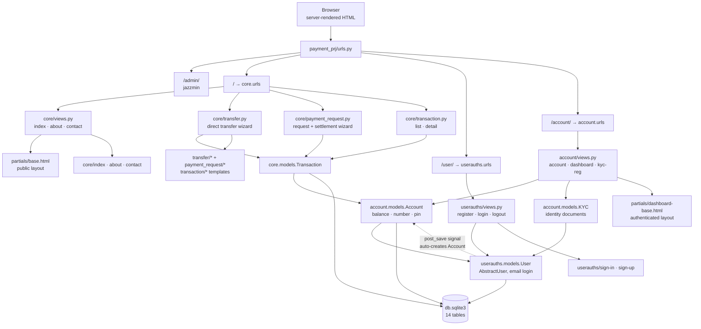

# Project Context

> Generated during a read-only reconnaissance pass on **2026-09-16**.
> Nothing in the repository was modified to produce this document except the creation of this file.
> Every claim below is backed by a file read or a command whose result is recorded in
> [Appendix A — Evidence log](#appendix-a--evidence-log).

---

## What It Is

**Paylio** — a demo/portfolio-grade online banking & payment web application built with Django.
Users register an account, submit KYC identity documents, then move money between "accounts"
using three flows: **direct transfer**, **payment request** (ask someone for money), and
**request settlement** (pay a request that was sent to you). Each account holds a balance and a
4-digit PIN that authorises money movement.

It is a **server-rendered Django monolith** — no SPA, no REST API in practice (DRF is in
`requirements.txt` but wired into nothing), no background workers, no payment-gateway
integration. "Banking" is simulated entirely inside the app's own SQLite tables.

---

## Tech Stack (as-shipped)

| Layer | As declared / as shipped |
| --- | --- |
| Language / runtime | Python — **no version pinned**; source targets the Django 3.1 era (Python 3.6–3.9) |
| Framework | **Django 3.1.13** (per `settings.py` header comment); `Django` is **unpinned** in `requirements.txt` |
| Database | **SQLite** — `db.sqlite3` (225 KB) committed in the repo root, with live data |
| Admin theme | `django-jazzmin` (theme `cyborg`), site branded "Paylio" |
| Key libraries | `django-shortuuidfield` / `shortuuid` (ID & PIN generation), `Pillow` (KYC image fields), `django-import-export` (admin list views) |
| Templates | Django Template Language, 23 template files, 2 base layouts |
| Build tool | **None.** No `pyproject.toml`, `setup.py`, `Makefile`, `Dockerfile`, or bundler. Front-end assets are pre-compiled CSS/JS copied into `static/` |
| Front-end | jQuery + Bootstrap 5 (vendored), SCSS sources present but **not compiled by any build step** |
| Test framework | `django.test.TestCase` — configured, but **zero tests written** |
| CI/CD | **None** |

**Project version:** none declared anywhere. There is no `package.json`, `pyproject.toml`,
`setup.py`, `__version__`, or `VERSION` file.

---

## Architecture

A single Django project (`payment_prj`) containing three custom apps plus the Jazzmin-themed
admin. `core` is the business-logic app: it holds the `Transaction` model and splits the
money-movement views across three sibling modules (`transfer.py`, `payment_request.py`,
`transaction.py`) that are routed from `core/urls.py`. `userauths` owns a **custom user model**
authenticated by **email** instead of username. `account` owns `Account` (one-to-one with `User`,
holding balance, account number, and PIN) and `KYC` (identity documents).

The flow is a multi-step wizard spread across separate URLs and templates: *search account →
enter amount → confirm → enter PIN → process → completed*. State between steps is carried by a
`Transaction` row created in the "processing" state plus the account number in the URL.

A structural quirk worth knowing up front: **`account` and `userauths` ship no `migrations/`
package at all** (see [Known Issues](#known-issues--red-flags)), so their tables are managed by
Django's legacy `syncdb` path rather than by migrations. Only `core` is a properly migrated app.



---

## Entry Points

- **Main file:** `manage.py` (sets `DJANGO_SETTINGS_MODULE=payment_prj.settings`)
- **WSGI:** `payment_prj/wsgi.py` → `application`
- **ASGI:** `payment_prj/asgi.py` (default scaffold, unused)
- **Settings:** `payment_prj/settings.py` (180 lines)
- **Root URLConf:** `payment_prj/urls.py` (19 lines, 4 mounts)
- **Business logic:** `core/transfer.py` (169 lines), `core/payment_request.py` (188), `core/transaction.py` (33)

### Key modules

| File | Role |
| --- | --- |
| `core/models.py` | `Transaction` — the only `core` model; 6 statuses, 6 types, 5 FKs |
| `core/transfer.py` | 6 views: search → amount → **process** → confirm → **PIN/execute** → completed |
| `core/payment_request.py` | 10 views: request-a-payment wizard + settlement wizard + delete |
| `core/transaction.py` | 2 views: transaction list, transaction detail |
| `account/models.py` | `Account` + `KYC` + the `post_save` signal that auto-creates an `Account` per `User` |
| `account/forms.py` | `KYCForm` |
| `userauths/models.py` | Custom `User` (`USERNAME_FIELD = 'email'`, `REQUIRED_FIELDS = ['username']`) |
| `userauths/views.py` | Register / Login / Logout (function-based) |
| `templates/partials/base.html` | Public layout (landing, auth pages) |
| `templates/partials/dashboard-base.html` | Authenticated layout (sidebar, topbar) |

**Total: 31 Python files, 1,044 lines.** 26 of those files (≈ the whole app) live in the three
custom apps; admin/form/config boilerplate makes up the rest.

---

## Configuration

- **Env vars required:** **none.** Despite `django-environ`, `python-decouple`, `django-dotenv`
  and `dj-database-url` all appearing in `requirements.txt`, `settings.py` imports none of them.
- **`.env` / `.env.example`:** does not exist. Nothing is read from the environment.
- **Hardcoded in `settings.py`:** `SECRET_KEY`, `DEBUG = True`, `ALLOWED_HOSTS = []`,
  SQLite path, Jazzmin theme.
- **Static:** `STATIC_URL = '/static/'`, `STATICFILES_DIRS = [BASE_DIR/'static']`.
  ⚠️ **`STATIC_ROOT` is never defined** — yet `payment_prj/urls.py` line 18 passes
  `document_root=settings.STATIC_ROOT` to `django.conf.urls.static.static()`. `STATIC_ROOT`
  falls back to Django's global default of `None`, so the static-file serving route is
  registered with a `None` document root.
- **Media:** `MEDIA_URL = '/media/'`, `MEDIA_ROOT = BASE_DIR/'media'`. The `media/` directory
  **does not exist** in the repo; KYC uploads (`ImageField` for photo and signature) would be
  written there at runtime and are therefore not versioned.
- **Auth:** `AUTH_USER_MODEL = 'userauths.User'`, `LOGIN_URL = "userauths:sign-in"`,
  `LOGOUT_REDIRECT_URL = "userauths:sign-in"`.
- **External services:** **none at runtime.** No database server, no S3, no email, no payment
  gateway. `boto3`/`sendgrid`/`psycopg2` are installed but referenced by no code.
- **Unused production settings:** `whitenoise` is in `requirements.txt` but **absent from
  `MIDDLEWARE`** — a production static-file setup that was never wired up.

---

## Current State (health check)

| Signal | Value |
| --- | --- |
| **Last commit date** | ⚠️ **Unavailable — there is no git repository.** See [Blocker](#-blocker-no-git-history). |
| **Last commit message** | ⚠️ Unavailable |
| **Repo URL** | ⚠️ Unknown — no `.git`, no remote. Directory name `O-Banking_Payment_Project-main` matches the **GitHub ZIP-download** naming convention, so this is almost certainly a downloaded snapshot rather than a clone. |
| **Local path** | `C:\Users\oussa\OneDrive\Bureau\O-Banking_Payment_Project-main` |
| **File timestamps** | All files share one timestamp: **2026-09-16 03:03** (the ZIP extraction time). Useless as an age signal. |
| **Test coverage** | **0 tests.** 3 files named `tests.py`, 4 lines total, all `from django.test import TestCase` stubs. No pytest, no coverage config. |
| **Build status** | **Not yet tested.** No build step exists. Runtime health is unknown — see [Open Questions](#open-questions). |
| **Database state** | `db.sqlite3` contains **live data**: 4 users, 4 accounts, 4 KYC records, 24 transactions, 58 admin-log entries, 11 sessions, 34 migration records. |

### File inventory

| Area | Count | Notes |
| --- | --- | --- |
| Python source | 31 files / 1,044 lines | excl. `__pycache__` |
| Templates | 23 files / ~280 KB | 2 base layouts + 21 pages |
| Static assets | 206 files / ~11.8 MB | **two** near-duplicate theme trees (below) |
| Migrations | 3 files | `core` only |
| Tests | 3 stubs / 4 lines | no assertions |
| Config files | 1 real (`.vscode/settings.json`, 6 lines) | no env, Docker, or CI config |

---

## Known Issues / Red Flags

Recon surfaced a lot. They are grouped by severity, not by file.

### 🔴 Critical — security

1. **Negative-amount transfer → theft.** `core/transfer.py:61`
   `amount = float(request.POST.get("amount-send", 0))`. There is **no sign or range check**.
   A negative amount passes the `sender_account.account_balance >= Decimal(amount)` guard, and
   `TransferProcess` then does `sender_account.account_balance -= transaction.amount` (sender
   *gains*) and `account.account_balance += transaction.amount` (recipient *loses*). An attacker
   can drain any account whose number they know.
2. **`@login_required` is commented out on the view that moves money.** `core/transfer.py:51` —
   `# @login_required` sits directly above `process_amount_transfer`. Ten of the thirteen
   money/transaction views have **no authentication decorator at all**: `AmountTransfer`,
   `process_amount_transfer`, `TransferConfirmation`, `TransferProcess`, `TransferCompleted`,
   and everything in `payment_request.py` except `searchUsersRequest`.
3. **No ownership checks (IDOR).** `TransferProcess` and `Settlement_processing` load a
   `Transaction` straight from the URL and mutate balances **without verifying that
   `request.user` is a party to it**. Likewise `transaction_detail` (`core/transaction.py:26`)
   is `@login_required` but renders **any** transaction ID — a logged-in user can read other
   users' amounts and descriptions. Only `DeletePaymentRequest` performs an ownership check.
4. **Account PINs are stored in plaintext and compared with `==`.** `account/models.py:60` —
   `account_pin = ShortUUIDField(unique=True, length=4, alphabet="1234567890")` is just a
   `CharField`. That is a **4-digit secret in cleartext**, checked non-constant-time at
   `transfer.py:135` and `payment_request.py:92,134`. `unique=True` also means PINs are globally
   unique (leaking information about other users' PINs) and the keyspace is only 10,000 values,
   so registrations would start failing with integrity errors after ~10k users. Should be hashed
   via `make_password`/`check_password`.
5. **`SECRET_KEY` hardcoded and committed; `DEBUG = True`; `ALLOWED_HOSTS = []`.**
   `settings.py:27-32`. Debug mode leaks source, settings, and SQL in tracebacks.
6. **`db.sqlite3` is committed with real personal data.** 4 KYC records (full name, date of
   birth, address, mobile, fax), 4 user emails and password hashes, and 11 session rows — a
   leaked session key is a account-takeover vector. Should be purged from the repo and
   `.gitignore`d.
7. **No `.gitignore` exists at all**, which is how `db.sqlite3`, `__pycache__/`, and the
   duplicated asset trees ended up in the snapshot.
8. **Logout is a GET request** (`userauths/urls.py:9`, linked from templates) — no CSRF
   protection on a state-changing endpoint. Minor, but Django 5+ would require POST.

### 🟠 High — the app is broken on its happy paths

These are static findings from cross-checking every `redirect()` and `` against the
URLConf. Three names are referenced that **do not exist** in any `urls.py`:

| Broken reference | Location | Consequence |
| --- | --- | --- |
| `redirect("core:TransferConfirmation", …)` | `core/transfer.py:83` | **`NoReverseMatch` on every successful transfer.** The correct name is `transfer-confirmation`. The primary feature 500s immediately after creating the transaction. |
| `redirect("core:search-user-by-account-number")` | `core/transfer.py:42` | `NoReverseMatch`; correct name is `search-account`. Fires whenever an account lookup fails. |
| `` | `templates/account/dashboard.html:370` | `NoReverseMatch` — **latent**, because it sits inside `` and `credit_card` is never put into any context. There is no `Card` model anywhere in the project. Dead feature. |

Two further runtime breakages that are *not* name typos:

9. **Missing templates** (rendered path ≠ file on disk):
   - `core/transaction.py:32` renders `transaction/transaction-detail.html`; the file is
     **`transaction_detail.html`** (underscore). → **Transaction detail page always 500s.**
   - `core/payment_request.py:180` renders `payment_request/delete-request.html`; the file is
     `delete-payment-request.html` — and it is **0 bytes**. → `TemplateDoesNotExist`.
10. **`redirect()` with missing arguments.** `core/payment_request.py:148` calls
    `redirect("core:settlement-completed")` with no args, but the route requires
    `<account_number>/<transaction_id>`. → `NoReverseMatch` **on the successful settlement
    path.**
11. **View returns `None`.** In `Settlement_processing`, the insufficient-funds branch
    (`payment_request.py:135-136`) emits a warning and then falls out of the function without
    returning a response → `ValueError: The view … didn't return an HttpResponse object`.

### 🟡 Medium — data model & admin

12. **`account` and `userauths` ship no migrations, and their history was rewritten.**
    Only `core/migrations/` exists, yet `db.sqlite3`'s `django_migrations` table records
    **13 `account` migrations (`0001`–`0011`) and 2 `userauths` migrations** that no longer
    exist in the source — including `account 0011_…` applied *before* a second,
    renumbered `account 0002_…`. That ordering is the signature of "deleted the migrations
    folder and regenerated from scratch."
    **Consequences:** (a) a fresh database can only be built with
    `migrate --run-syncdb`; (b) **schema changes to `Account`, `KYC`, or `User` will never be
    applied by `migrate`** — they will silently diverge from the database.
13. **`makemigrations` state ≠ models for `core`.** Migration `0002` sets `status`/`transaction_type`
    choice labels to Title Case (`'Failed'`, `'Withdraw'`), but `core/models.py` has them
    lowercase (`'failed'`, `'withdraw'`). A new migration is pending and un-generated.
14. **`Account.__str__` is nested inside `class Meta`** (`account/models.py:84-87`), so the method
    never reaches the class. `str(account)` returns `"Account object (1)"` instead of the user.
15. **`post_save` signals are connected from inside the `KYC` class body** — and specifically
    inside its `class Meta` (`account/models.py:141-153`). They work only as an import-time side
    effect and would not be discovered by `AppConfig.ready()`. `save_account` calls
    `instance.account.save()` on **every** `User` save, which raises
    `RelatedObjectDoesNotExist` for any user lacking an `Account`.
16. **`KYCForm` declares a field that does not exist on the model.** `identity_image` is declared
    as an `ImageField` and included in `Meta.fields`, but `KYC` has **no `identity_image` column**.
    Users can upload an ID document that is **silently discarded**.
    Conversely `nationality` is a non-null model field **missing from the form** → always saved
    as `""`.
17. **`KYC.image` and `KYC.signature` are re-declared as required in the form**, overriding the
    model's `default="default.jpg"`. Editing KYC therefore always demands re-uploading both
    files. (`date_of_birth` is also a `DateTimeField` fed by a `DateInput` widget — should be a
    `DateField`.)
18. **`import_export` is imported but not installed.** `account/admin.py:4` imports
    `ImportExportModelAdmin`, but `import_export` is **absent from `INSTALLED_APPS`**.
19. **Custom `User` is registered with plain `admin.site.register(User)`** (`userauths/admin.py:5`)
    instead of `UserAdmin`, so the admin shows the raw password hash rather than a password form.
20. **`username` uniqueness was silently dropped.** `userauths/models.py:5` re-declares
    `username = models.CharField(max_length=100)`, overriding `AbstractUser`'s `unique=True`.
    `is_staff`/`is_superuser` are also re-declared redundantly.
21. **`Transaction.updated` is never written.** `core/models.py:73` uses
    `auto_now_add=False` with `null=True` and no assignment anywhere → permanently `NULL`.
22. **Typo tax:** `reciever`, `reciever_account`, `marrital_status`, `MarrtialStatus`,
    `MARRTIAL_STATUS`. Consistent, but permanent API surface.
23. **`MARRTIAL_STATUS` and `GENDER` are Python `set`s of tuples, not tuples.** Ordering is
    non-deterministic, which causes spurious migration churn.
24. **`AmountRequestProcess` never validates its amount.** `payment_request.py:54` stores the raw
    POST string into a `DecimalField` — non-numeric input raises `InvalidOperation` → 500.

### 🔵 Low — hygiene

25. **Two near-duplicate asset trees, both in active use.** `static/assets/` (6.30 MB) and
    `static/assets1/` (5.52 MB) are different revisions of the same theme. **77 template
    references point at `assets/`, 76 at `assets1/`** — `partials/base.html` loads `assets1/`
    while `partials/dashboard-base.html` loads `assets/`, so the public pages and the dashboard
    render from **different stylesheet revisions**. ~11.8 MB of static payload.
26. **`__pycache__/` with `.pyc` files is committed.** Curiously they are `cpython-311` bytecode,
    plus one stray `wsgi.cpython-313.pyc`.
27. **`requirements.txt` is ~90 % dead weight.** Only **five** third-party distributions are
    actually imported or installed by this project: `Django`, `django-jazzmin`,
    `django-import-export`, `shortuuid`, and `Pillow` (implied by `ImageField`). Everything else
    — DRF, simplejwt, djoser, `django-rest-auth`, boto3/botocore/s3transfer, `django-storages`,
    psycopg2, `django-heroku`, sendgrid, pandas, lxml, celery-era helpers, CKEditor, TinyMCE,
    taggIt, crispy-forms, widget-tweaks, whitenoise, gunicorn — is referenced by no code.
28. **`about`/`contact` views are unreachable.** `core/views.py` defines them, but `core/urls.py`
    routes only `index`. `templates/core/about.html` and `contact.html` are 8–10 line
    placeholders (`<h1>About Page</h1>`), and `base.html:72` links to a **hardcoded
    `about-us.html`** that exists nowhere. The public marketing site is a shell.
29. **`settings.py` retains a duplicate-logic pair:** `account.views.account` and
    `account.views.dashboard` are near-identical copies of each other.
30. **`delete-payment-request.html` is 0 bytes** — an empty placeholder that is also misnamed
    (see #9).

---

## Age Assessment

**The project is roughly 3–4 years old and is built on a runtime that has been unsupported for
over four years.**

| Signal | Reading |
| --- | --- |
| Django declared | **3.1.13** — released 2020-08-04; **active support ended 2021-04-06; security support ended 2021-12-07.** Unsupported for ~4 years 9 months as of today. Last 3.1 patch ever was 3.1.14 (2021-12-07). |
| Python required by Django 3.1 | 3.6–3.9. **Python 3.13.1** is what is installed on this machine — **the declared stack cannot run on the available interpreter at all.** |
| Dependency pin era | The 28 pinned packages cluster tightly in **Dec 2021 – Feb 2022** (`boto3==1.20.26`, `botocore==1.23.54`, `requests==2.27.1`, `django-storages==1.12.3`, `django-taggit==3.0.0`, `django-environ==0.9.0`). |
| Code-era tell | `JAZZMIN_SETTINGS["copyright"] = "… Copyright 2023"`, and migration history was rewritten at least once. |
| Verdict | Code written **~2022–2023** on a then-already-ageing Django 3.1 tutorial stack. "About 3 years ago" matches. |

### ⚠️ The environment has already drifted past the project

This is the single most important age finding, and it is not in the repo — it is on the machine:

- **Django 6.0 is installed globally** (`C:\Python313`), alongside `jazzmin 3.0.1`,
  `django-filter 25.2`, and `import-export 4.3.14`. Because `requirements.txt` lists `Django`
  **unpinned**, a `pip install -r requirements.txt` today resolves to the **latest** Django —
  a **five-major-version jump** (3.1 → 6.0) over code written for 3.1.
- Django 6.0 supports Python 3.12–3.14 only, which is why a 3.13 interpreter pulled Django 6.0.
- There is **no virtualenv** in the project — dependencies were installed into the global
  interpreter, mixed with unrelated packages (`django-cors-headers`, `django-hosts`,
  `django-subdomains`, `social-auth-app-django`, …).
- Some good news: `shortuuid.django_fields.ShortUUIDField` — used for **every** ID, account
  number and PIN in this app — resolves to the modern implementation in `shortuuid 1.0.13`
  (it imports `gettext_lazy`, uses type hints, no removed APIs). **It is Django-6 compatible**,
  so the highest-risk third-party dependency is not the blocker. (Note `requirements.txt` also
  lists the long-obsolete `django-shortuuidfield==0.1.3`, which provides a *differently named*
  module, `shortuuidfield` — the code imports `shortuuid.django_fields`, so that package is
  dead weight and a name-collision trap.)

### How hard will a modernisation be?

**Moderate, not mechanical.** Reasoning:

- ✅ **Small surface area.** Only 1,044 lines of Python across 26 app files. The business logic
  worth preserving is concentrated in 3 files (~390 lines).
- ✅ **No exotic dependencies to replace.** The five packages actually used are all maintained,
  and the riskiest one (ShortUUIDField) is already modern.
- ✅ **No ORM/renderer-dependent front end.** Templates are plain DTL; no React/Vue build to
  re-do.
- ⚠️ **The declared stack cannot execute.** Django 3.1 + Python 3.13 is impossible. A modern
  Django is *required* before the app can run at all — so the upgrade is not optional and its
  failures will be discovered at the same time as everything else.
- ⚠️ **Migration history must be rebuilt** for `account` and `userauths` before any schema work
  (#12). This is the fiddliest part and must be done without destroying the 4 users / 24
  transactions in `db.sqlite3`.
- ⚠️ **The happy paths are already broken** (issues #1–#11). "Does the upgrade work?" cannot be
  answered by the test suite, because there isn't one — correctness has to be re-established by
  hand or by writing the missing tests first.
- ⚠️ **Security work is not optional.** This is a payments app whose transfer path accepts
  negative amounts, has no auth on money movement, stores PINs in cleartext, and has no
  ownership checks. Modernising dependencies *without* fixing these would be the wrong order of
  operations.

---

## 🚧 Blocker: no git history

**Recon item #9 cannot be completed as specified.** `git rev-parse` returns:

```
fatal: not a git repository (or any of the parent directories): .git
```

There is no `.git/`, no remote, and no `.gitignore`. Therefore **the last-20-commits list, the
most-recent-commit date, and the last commit message do not exist to be reported** — not "are
unknown to me," but *were never present in this snapshot*. The directory name
`…_Project-main` is GitHub's ZIP-export convention.

Two consequences for the plan:

1. **There is no safety net.** Any change we make has no baseline to diff or revert to.
   Recovering the history (if the project still exists on GitHub) is worth doing **before**
   touching code, and a `git init` + initial commit is worth doing even if the original
   history is gone.
2. **Age/staleness must be inferred from content**, which is what the table above does.

Everything else in Phase 1 and Phase 2 is complete.

---

## Open Questions

Facts I genuinely cannot determine from the code alone — I need your input:

1. **Where is the repo?** Is there a GitHub/GitLab URL for this project, or is this ZIP the only
   copy? If the history exists remotely, the fastest first move is to re-clone it properly.
2. **What was `db.sqlite3` for — real use or a demo?** It holds 4 users, 4 KYC records (names,
   dates of birth, addresses, mobile numbers), and 24 transactions. If any of that is real
   personal data, it needs to be treated as a leak and purged. If it is seed/demo data, it is
   still likely test fixtures worth keeping *outside* the repo. **Which is it, and must the data
   be preserved?**
3. **Your goal — which is it?** Modernise dependencies, portfolio refresh, add a feature, or
   just explore the drift? The answer changes the plan substantially. My read is that the
   *honest* ordering is: (a) get it running on a modern Django in a venv, (b) make the happy
   paths work, (c) fix the payment-security holes, (d) then modernise/refactor. But if this is
   purely a portfolio piece, a rewrite of the 390 lines of business logic may beat a port.
4. **Did this ever run in production?** `requirements.txt` is staged for Heroku
   (`gunicorn`, `django-heroku`, `dj-database-url`, `psycopg2`, `whitenoise`,
   `django-storages`+`boto3` for S3 media) — but **`settings.py` wires up none of it** and uses
   SQLite. Was there a deployed version with a Postgres/S3 settings module that didn't make it
   into this snapshot, or was Heroku merely planned?
5. **Is the "Paylio" front-end theme yours?** Two revisions are vendored under
   `static/assets/` and `static/assets1/` and templates mix them. If it is a purchased theme,
   the licence may matter; if it is yours, we can consolidate to one tree and drop ~6 MB.
6. **`pip install -r requirements.txt` has already been run globally on this machine**
   (Django 6.0, jazzmin 3.0.1, and the Heroku/DRF packages are all present). Was that you,
   recently? It matters because it means the global environment no longer matches either the
   project *or* a clean baseline, and I would want to work inside a fresh virtualenv.
7. **Am I permitted to run the project?** Phase 1 was explicitly read-only, so I did **not**
   execute `manage.py check`, `migrate`, or `runserver` — not even to generate `.pyc` files.
   The migration/`INSTALLED_APPS`/Django-6 findings above are static analysis and should be
   confirmed at runtime. Say the word and I will verify them in a throwaway venv with the
   database copied aside, so `db.sqlite3` is never touched.

---

## Appendix A — Evidence log

Read-only commands executed (no file in the repo was created, modified, or deleted; this
document is the only write):

| # | Command / action | What it established |
| --- | --- | --- |
| 1 | `Get-ChildItem -Force` on root | Top-level layout; no `.git`, no `README.md`, no `.gitignore` |
| 2 | `git rev-parse --is-inside-work-tree` | `fatal: not a git repository` → no history exists |
| 3 | Read `requirements.txt` (48 lines) | 28 pinned / 20 unpinned; Heroku-era stack |
| 4 | Read `manage.py`, `payment_prj/{settings,urls,wsgi}.py` | Entry points, Django 3.1.13, hardcoded secrets, missing `STATIC_ROOT` |
| 5 | Read all `models.py` / `views.py` / `urls.py` / `forms.py` / `admin.py` in the 3 apps | Data model, auth model, 18 views, admin registrations |
| 6 | Read `core/{transfer,payment_request,transaction}.py` | Money-movement logic; found negative-amount, missing-auth and IDOR issues |
| 7 | Read both `core/migrations/*.py` | Migration-vs-model choice-label divergence |
| 8 | Opened `db.sqlite3` read-only via `sqlite3.connect('file:…?mode=ro', uri=True)` | 14 tables, row counts, 34 migration records incl. the 13 orphaned `account` migrations |
| 9 | Cross-checked every `name="…"` in `urls.py` against every `redirect()` and `` | 25 names defined vs 27 referenced → 3 undefined (`card-detail`, `search-user-by-account-number`, `TransferConfirmation`) |
| 10 | Cross-checked every `render(request, "…")` against files on disk | 2 missing templates (`transaction-detail.html`, `delete-request.html`) |
| 11 | Counted `` vs POST forms (13 forms) | **All present — CSRF protection is correctly wired** |
| 12 | Counted `assets/` vs `assets1/` template references | 77 vs 76 — both trees live |
| 13 | `python --version`, `python -c "import django; print(django.get_version())"`, `pip list` | Python **3.13.1**, Django **6.0** — a five-major-version gap |
| 14 | Inspected installed `shortuuid/django_fields.py` + scanned for removed Django APIs (`smart_text`, `force_text`, `ugettext`, …) | ShortUUIDField is modern and Django-6 compatible; 0 removed APIs in it or in jazzmin |
| 15 | `web_fetch` endoflife.date/django | Django 3.1: released 2020-08-04, security support **ended 2021-12-07**, Python 3.6–3.9 |

**External reference:** [endoflife.date — Django release & support matrix](https://endoflife.date/django)

### Phase 1 checklist status

| # | Requested item | Status |
| --- | --- | --- |
| 1 | Top-level structure / project type | ✅ single Django monolith, 3 apps |
| 2 | Read `README.md` in full | ⚠️ **File does not exist** — purpose inferred from code |
| 3 | Dependency manifests | ✅ `requirements.txt` (only manifest); no dev deps declared |
| 4 | Entry points | ✅ |
| 5 | Folder structure (3 levels) | ✅ |
| 6 | Configuration files | ✅ only `.vscode/settings.json`; no env/Docker config |
| 7 | CI/CD | ✅ **none present** |
| 8 | Tests | ✅ 3 stubs, 4 lines, 0 assertions |
| 9 | Git history (last 20 commits) | 🚧 **Blocked — no git repository** |
| 10 | Age signals | ✅ inferred from pins, comments, and the migration table |

Nothing has been installed, upgraded, migrated, or executed against the database. No application
file was modified.
